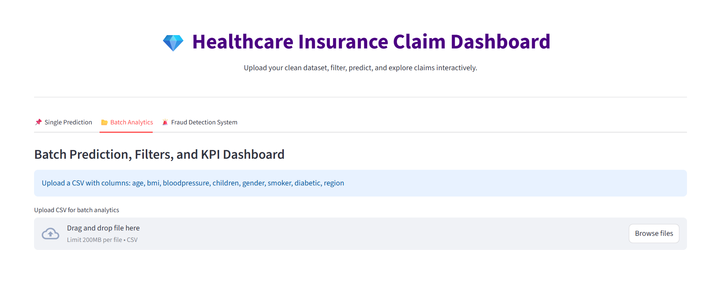
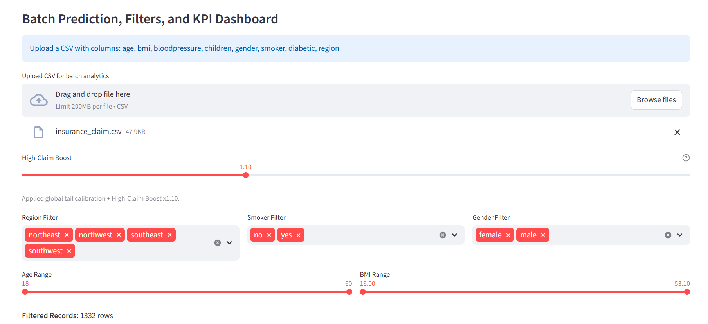
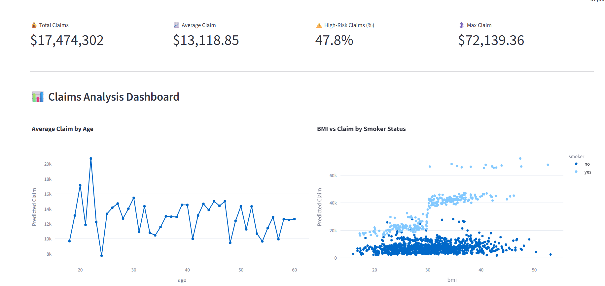
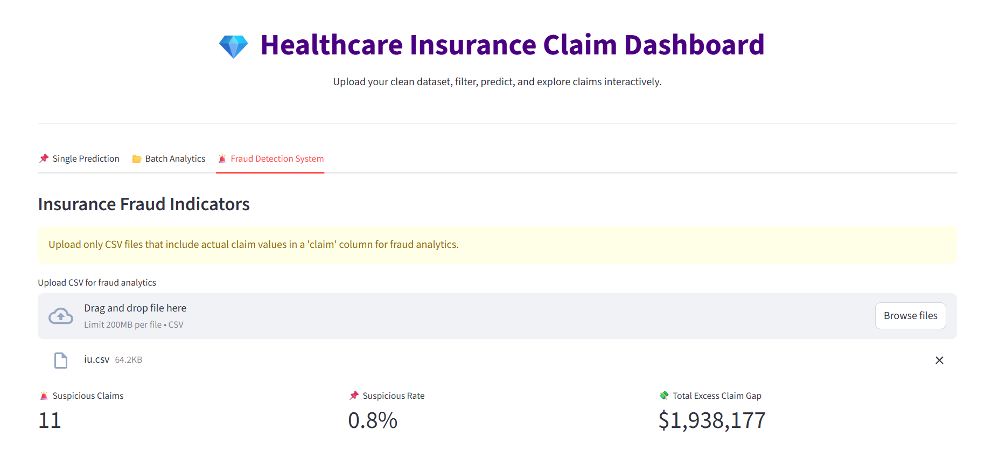
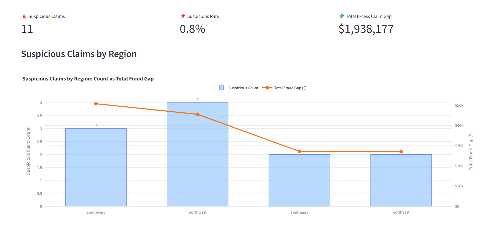
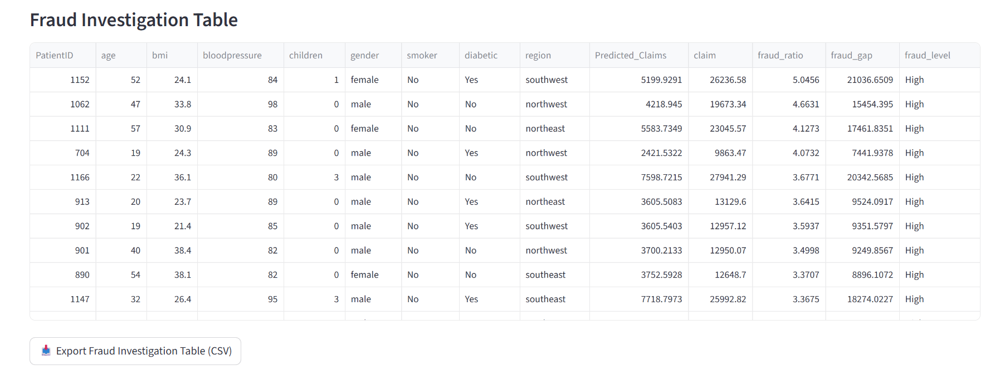

# Insurance Claim Prediction and Fraud Analytics Dashboard

## Overview

This project combines machine learning claim prediction with an interactive Streamlit dashboard for:

1. Quick single-record prediction,
2. Batch prediction with KPI and visual analytics, and
3. Insurance fraud investigation.

The model is a Random Forest pipeline with log-target handling and calibration logic to improve upper-tail claim estimates.

## Dashboard Tabs

### 1. Single Prediction

- Fast prediction for one profile.
- No filters and no charts.

### 2. Batch Analytics

- CSV upload and model scoring.
- Optional tail calibration handling.
- Interactive filters for region, smoker, gender, age, and BMI.
- KPI cards, trend visuals, donut chart, and heatmap.
- Download filtered prediction output as CSV.

### 3. Insurance Fraud Detection

- Requires CSV with actual claim column (`claim`).
- If `claim` is missing, app shows an informational warning.
- Fraud rule used:

	Actual Claim > 3 x Predicted Claim

- Includes:
	- Suspicious Claims by Region (count + total fraud gap),
	- Predicted vs Actual scatter plot,
	- Top Suspicious Claims table,
	- Fraud Investigation table.
- Includes CSV export for:
	- suspicious claims,
	- fraud investigation table.

## Dashboard Screenshots

### Batch Analytics

Overview and main filtering workflow:







### Insurance Fraud Detection

Fraud review flow with flagged output and investigation views:







## Dataset

The project uses healthcare insurance claim data with demographic and health variables.

Core features:

- age
- bmi
- bloodpressure
- children
- gender
- smoker
- diabetic
- region

Target:

- claim (insurance claim cost)

## Quick Start

### Installation

```bash
git clone <https://github.com/femijulius560/healthcare_insurance_claim.git>
cd "insurance claim analysis"
python -m venv .venv
# Windows
.venv\Scripts\activate
# macOS/Linux
source .venv/bin/activate
pip install -r requirements.txt
```

### Run Dashboard

```bash
streamlit run app.py
```

## Project Structure

```text
insurance claim analysis/
|-- app.py
|-- data/
|   |-- raw/
|   |   `-- insurance_claim_raw.csv
|   `-- processed/
|       |-- insurance_claim_cleaned.csv
|       `-- predictions_full_report.csv
|-- models/
|   `-- rf_pipeline.pkl
|-- notebooks/
|   `-- claim_analysis.ipynb
|-- reports/
|   `-- figures/
|       |-- static_dashboard.png
|       `-- streamlit/
|           |-- batch/
|           |   |-- batch-01-overview.png
|           |   |-- batch-02-filters.png
|           |   |-- batch-03-upload-results-a.png
|           |   |-- batch-04-upload-results-b.png
|           |   `-- batch-05-upload-results-c.png
|           `-- fraud/
|               |-- fraud-01-overview.png
|               |-- fraud-02-flagged-results-a.png
|               |-- fraud-03-flagged-results-b.png
|               |-- fraud-04-top-suspicious-table.png
|               `-- fraud-05-full-investigation-table.png
|-- requirements.txt
`-- README.md
```

## Tech Stack

- Python
- Pandas
- NumPy
- Scikit-Learn
- Plotly
- Streamlit
- Joblib

