# Insurance Claim Prediction and Fraud Analytics Dashboard

## Overview

This project combines machine learning claim prediction with an interactive Streamlit dashboard for:

1. Single-record prediction with SHAP explainability and scenario simulation,
2. Batch prediction with KPI and visual analytics, and
3. Insurance fraud investigation.

The model is a Random Forest pipeline with log-target handling and calibration logic to improve upper-tail claim estimates.

**Live Demo:** https://fraudintelligence.streamlit.app/

## Dashboard Tabs

### 1. Single Prediction & Explainability

- Fast claim estimate for one patient profile.
- Every prediction generates a **unique UUID prediction ID** with a timestamp.
- Full prediction record stored with all input features, predicted claim, and timestamp.
- **SHAP Explainability** per prediction:
  - Log-space SHAP values and dollar contributions computed via `TreeExplainer`.
  - Feature contribution table showing SHAP value (log-space) and `$` contribution to the predicted claim.
  - Horizontal bar chart with dollar contribution per feature, colour-coded by direction.
- **Scenario Simulation** (health / lifestyle changes):
  - Single editable form pre-filled with the active prediction's values.
  - Each run appends a new row to a cumulative comparison table.
  - Comparison table includes a Baseline row + all added scenarios with `delta_vs_current`.
  - Clear All Scenarios button to reset between experiments.
  - Download scenario comparison as CSV.
- **Session Prediction History** accumulates all predictions made during the session.
- Export any individual prediction profile or the full session history as CSV.

### 2. Batch Analytics

- CSV upload and model scoring.
- Optional tail calibration handling.
- Interactive filters for region, smoker, gender, age, and BMI.
- KPI cards, trend visuals, donut chart, and heatmap.
- Download filtered prediction output as CSV.

### 3. Insurance Fraud Detection

- Requires CSV with actual claim column (`claim`).
- If `claim` is missing, app shows an informational warning.
- Fraud rule used:

	Actual Claim > 3 x Predicted Claim

- Includes:
	- Suspicious Claims by Region (count + total fraud gap),
	- Predicted vs Actual scatter plot,
	- Top Suspicious Claims table,
	- Fraud Investigation table.
- Includes CSV export for:
	- suspicious claims,
	- fraud investigation table.

## Dashboard Screenshots

### Flash Prediction & Scenario Simulation

SHAP-driven explainability and scenario simulation for single predictions:

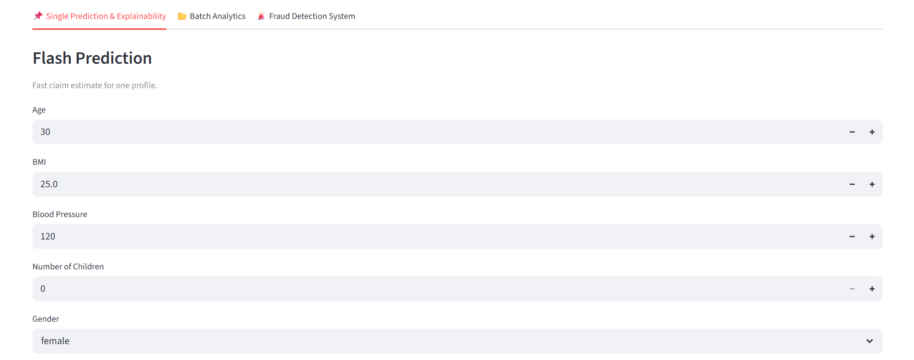

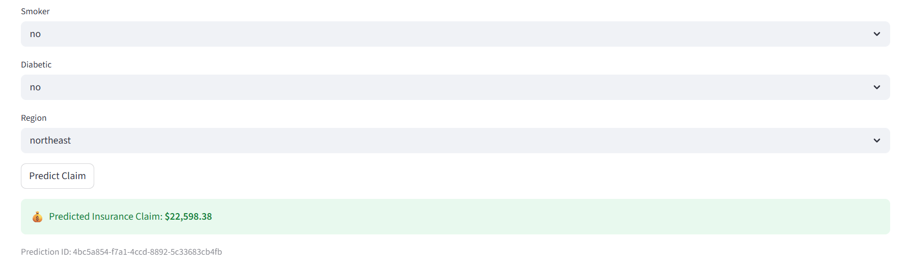

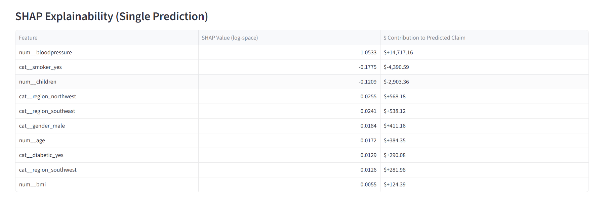

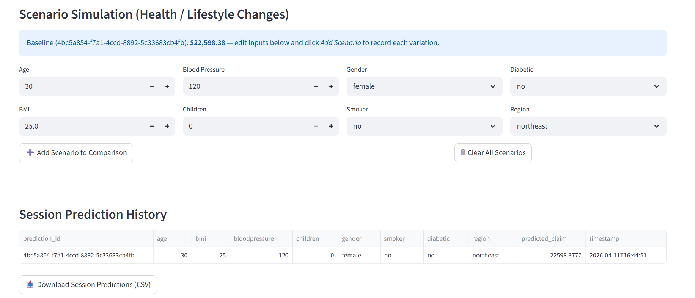

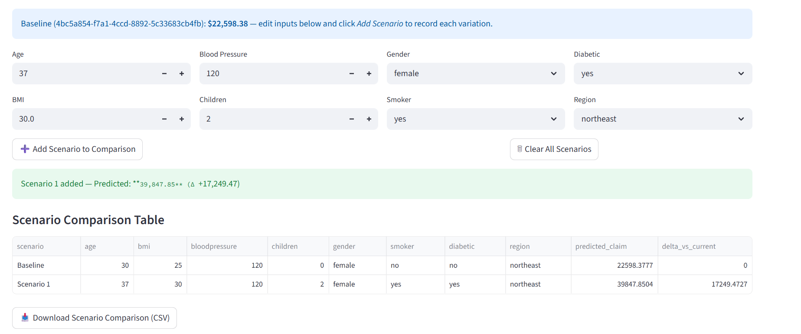

### Batch Analytics

Overview and main filtering workflow:

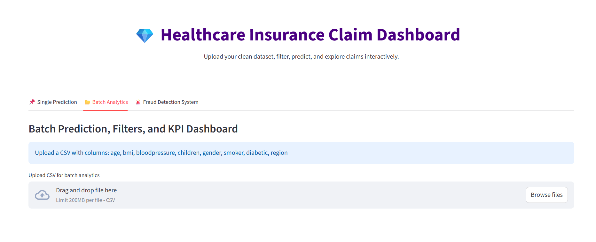

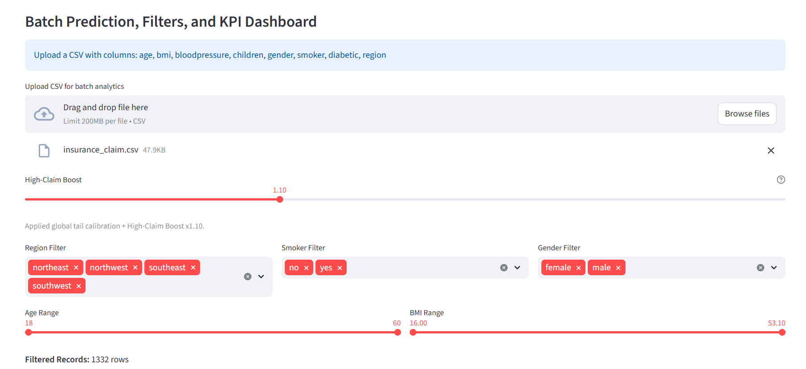

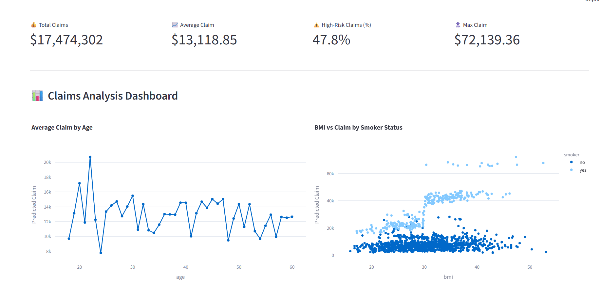

### Insurance Fraud Detection

Fraud review flow with flagged output and investigation views:

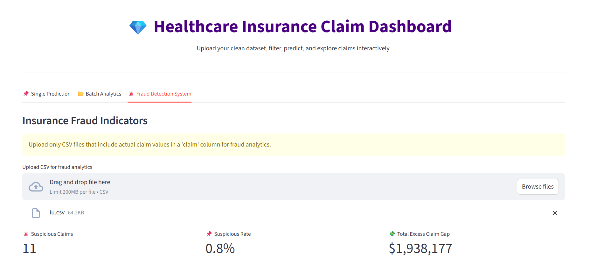

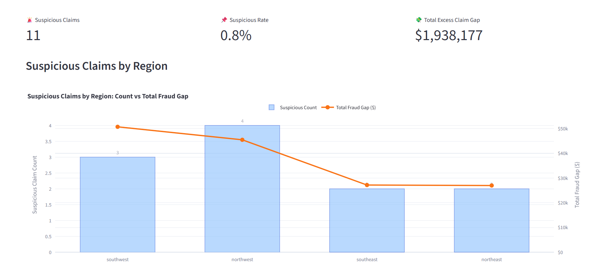

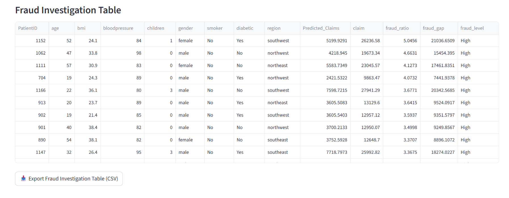

## Dataset

The project uses healthcare insurance claim data with demographic and health variables.

Core features:

- age
- bmi
- bloodpressure
- children
- gender
- smoker
- diabetic
- region

Target:

- claim (insurance claim cost)

## Quick Start

### Installation

```bash
git clone <https://github.com/femijulius560/healthcare_insurance_claim.git>
cd "insurance claim analysis"
python -m venv .venv
# Windows
.venv\Scripts\activate
# macOS/Linux
source .venv/bin/activate
pip install -r requirements.txt
```

### Run Dashboard

```bash
streamlit run app.py
```

## Project Structure

```text
insurance claim analysis/
|-- app.py
|-- data/
|   |-- raw/
|   |   `-- insurance_claim_raw.csv
|   `-- processed/
|       |-- insurance_claim_cleaned.csv
|       `-- predictions_full_report.csv
|-- models/
|   `-- rf_pipeline.pkl
|-- notebooks/
|   `-- claim_analysis.ipynb
|-- reports/
|   `-- figures/
|       |-- static_dashboard.png
|       `-- streamlit/
|           |-- batch/
|           |   |-- batch-01-overview.png
|           |   |-- batch-02-filters.png
|           |   |-- batch-03-upload-results-a.png
|           |   |-- batch-04-upload-results-b.png
|           |   `-- batch-05-upload-results-c.png
|           |-- flash/
|           |   |-- flash-01-prediction-overview-a.png
|           |   |-- flash-02-prediction-overview-b.png
|           |   |-- flash-03-prediction-overview-c.png
|           |   |-- flash-04-prediction-overview-d.png
|           |   `-- flash-05-prediction-overview-e.png
|           `-- fraud/
|               |-- fraud-01-overview.png
|               |-- fraud-02-flagged-results-a.png
|               |-- fraud-03-flagged-results-b.png
|               |-- fraud-04-top-suspicious-table.png
|               `-- fraud-05-full-investigation-table.png
|-- requirements.txt
`-- README.md
```

## Tech Stack

- Python
- Pandas
- NumPy
- Scikit-Learn
- Plotly
- Streamlit
- Joblib
- SHAP

